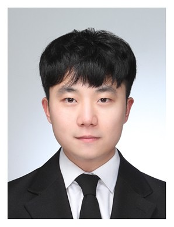

# Portfolio
       " 나를 믿어라. 
            인생에서 최대의 성과와 기쁨을 수확하는 비결은
                위험한 삶을 사는 데 있다. "  
    

 <h3>이름 : 엄태현
 <h3>생년월일 : 1993.09.15
 <h3>연락처 : 010-7417-8917
 <h3>E-mail : gkdlrhfo@naver.com
 <h3>MBTI : ISFP  

## Stack

--- 

# About Me

## 🍀Career

`2020.02.25 ~ 2021.12.31`

비알코리아 수도권직영팀 매장판매직 담당

`2017.08. ~ 2018.01.`

엠디유글로벌(주) 케이크생산부 생산직 

`2016.05. ~ 2017.06.`

대구 빠다롤 뺑 프랑스 생산직

## 🎓Education

`2022.03.10 ~ 2022.08.30`

휴먼교육센터학원 빅데이터전문가 수료

`2020.03. ~2021.09.`

서울호서직업전문학교 식품조리학과 학사학위 취득

`2018.03. ~ 2021.02`

서울호서직업전문학교 호텔제과제빵학과 전문학사 학위 취득

`2018.12.`

일본과자전문학교 교육수료 (1주)

`2018.07.`

프랑스국립제과제빵학교 INBP 교육 수료 (1주)

`2012.02.`

대구 영남고등학교 졸업

---

## 🧾Certificate

`2018.02.`

제과기능사

`2018.01.`

제빵기능사

`2014.09.`

정보처리기능사

`2012.02.`

자동차운전면허증

## 👩‍🚀**Related Skills**

`2022.05.20 ~ 2022.06.03`

부동산 금리계산기 서비스 챗봇 프로젝트

`2022.04.01 ~ 2022.05.01`

Kaggle Competition을 통한 시계열 데이터 분류 모델 연구

`2019.07.`

일본 교토 산학연수 (3주)

`2018.10.12 ~ 2018.10.14`

서울시 강서구 허준축제 아이싱쿠키부스 운영

`2018.03. ~ 2020.12.`

서울호서직업전문학교 호텔제과제빵학과 실습조교 활동

## 포트폴리오

`2022.05.20 ~ 2020.06.03`
[부동산 금리계산기 서비스 챗봇 프로젝트](ZIPFLIX프로젝트.pdf)

`2022.04.01 ~ 2022.05.01`
[Kaggle Competition을 통한 시계열 데이터 분류 모델 연구](시계열활용사례.pdf)